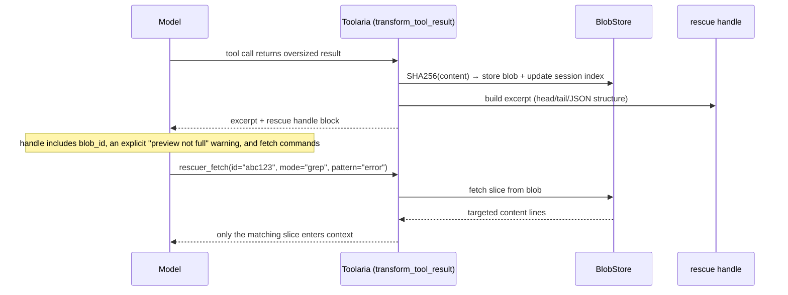

# Toolaria: rescue oversized tool results before they flood context

Toolaria is the spill-to-disk pattern, packaged as a single-purpose, zero-config
Hermes Agent plugin. When an MCP or web tool returns a result too large for the
context window, Toolaria stores the full output in a SHA256-addressed blob store
and hands the model a compact excerpt plus a fetch handle. The model retrieves
only the slices it needs via `rescuer_fetch`.

It does one thing, it is on by default, and it composes with whatever context
engine you run.

Beyond grep, a rescued blob becomes an **addressable, searchable scratch space**:

- **`outline`** gives the model a structural map (JSON schema with numeric
  column stats, HTML heading hierarchy, log error clusters) so it navigates by
  structure instead of guessing search terms.
- **`search`** runs semantic (or dep-free lexical) retrieval over the blob:
  ask in plain language, get the most relevant chunks with line numbers.
- **Pass-by-reference** lets the model hand a whole result to another tool
  without reading it: write `tla:<id>` as a downstream tool's argument and
  Toolaria expands it to the full content before that tool runs, so a 200k
  result flows tool to tool and never re-enters the context window.

---

## Proof

A real `web_extract` returning 2,000 transaction records, run through Toolaria:

| Moment | Without Toolaria | With Toolaria |
|---|---|---|
| Tool returns a 171,874-char result | all 171,874 chars flood context | model sees a **1,733-char** handle (**99x smaller**) |
| Model hands the result to a second tool | must read all 171,874 chars back in to pass them on | emits **79 chars** (`tla:<id>`); the tool receives the full 171,874 |
| Model needs the failed payments | scroll/grep blind through 171k chars | `outline` then `search "failed"` returns the matching rows with line numbers |

What the model actually sees when the result lands (truncated):

```
[Toolaria: tool result rescued. tool=web_extract; size=171,874 chars; lines=1; type=json array[2000]; blob=5ddff67d]
Preview (first 6 / last 3 lines); this is a preview, NOT the full output:
[JSON excerpt: array[2000]]
--- head ---
[ { "id": 0, "user": "user0", "amount": 0.0, "status": "failed", "note": "card declined insufficient funds" }, ... ]
...
To feed this whole result into another tool WITHOUT reading it, pass "tla:5ddff67d" as that tool's argument;
Toolaria expands it to the full content before the tool runs.
```

`rescuer_fetch(mode="outline")` then turns the blob into a structural map without
loading a single row, numeric columns summarised in place:

```
[JSON outline]
root: array, length 2000
elements: objects (sampled 1000):
  - id (int)      [n=1000 min=0 max=999 mean=499.5]
  - user (str)
  - amount (float) [n=1000 min=0.0 max=497.0 mean=244.35]
  - status (str)
  - note (str)
```

Reproduce it yourself: the numbers above come from the test fixtures and the
end-to-end stress suite (`tests/`), which also cover cross-session denial,
ReDoS-bounded grep, size-cap eviction, and single-line (minified JSON) search.

---

## 60-second Quickstart

```bash
# Clone into Hermes plugins directory
git clone https://github.com/Sahil-SS9/Toolaria.git ~/.hermes/plugins/toolaria

# Install dependencies (regex gives grep a safe mid-search timeout)
pip install -r ~/.hermes/plugins/toolaria/requirements.txt

# Enable in ~/.hermes/config.yaml:
plugins:
  enabled:
    - toolaria

# Restart gateway (or hermes plugin reload)
hermes plugin reload
```

Any oversized web extract, search, or MCP result now returns a compact excerpt
with a fetch handle instead of flooding context. Check status with `/rescuer`.

Run the test suite:

```bash
# Canonical runner (needs the regex package for the grep timeout tests)
uv run --with pytest --with regex python -m pytest tests/ -q

# With encryption-tier tests (needs the cryptography package)
uv run --with pytest --with regex --with cryptography python -m pytest tests/ -q
```

> **Availability in restricted sessions.** The rescue runs as an ungated hook, so
> it fires in every session, including toolset-restricted ones (cron jobs, scoped
> profiles). For the `rescuer_fetch` handle to be redeemable there, the tool must
> be reachable. On hosts that support ambient toolsets, Toolaria marks its
> `rescuer` toolset ambient at load, so nothing more is needed. On hosts that do
> not, Toolaria logs a warning at load; add `rescuer` to those sessions'
> `enabled_toolsets` so the handle can be fetched. A handle you cannot fetch is
> worse than no rescue, so Toolaria never fails this silently.

---

## Prior art

Spill-to-disk is a well-established pattern, not a Toolaria invention. Toolaria's
contribution is packaging, not the idea.

- **Claude Code** persists oversized tool results to disk and replaces them with
  a short preview; the model then reads the spilled file with offset/limit and
  grep. Toolaria's `range`/`grep`/`stat`/`full` modes mirror this.
- **OpenAI Codex** issue [#14206](https://github.com/openai/codex/issues/14206)
  specifies the same contract: spill the payload, return a reference plus
  preview, support full read, ranged read, and grep/search.
- **MCP ResourceLink** ([2025-06-18 spec](https://modelcontextprotocol.io/specification/2025-06-18/server/tools))
  lets a tool return a URI handle instead of inline content.
- **Context-offloading** as a named pattern: Anthropic's
  [context engineering](https://www.anthropic.com/engineering/effective-context-engineering-for-ai-agents)
  post, LangChain's
  [filesystems for context](https://www.langchain.com/blog/how-agents-can-use-filesystems-for-context-engineering),
  and the Manus "compression must be restorable" write-up.
- **[hermes-lcm](https://github.com/stephenschoettler/hermes-lcm)** is the
  closest in-ecosystem work. It is a full context-engine replacement (message
  store, summary DAG, cross-session search) where large-output externalisation
  is one opt-in knob among many, off by default, with a metadata-only
  placeholder. Toolaria is the opposite shape: a single-purpose interceptor,
  on by default, with the preview inline, no engine swap. They compose; you can
  run Toolaria alongside lcm or alongside Hermes core.

Toolaria positions against Hermes core's default behaviour (MCP/web results
bypass the standard truncation), not against lcm.

---

## How it works



The handle is deliberately explicit that the inline text is a preview, not the
full output, because the documented failure mode of this pattern is a model
treating the preview as complete.

---

## Configuration

All keys in `config.yaml` with defaults:

| Key | Default | Description |
|---|---|---|
| `max_result_chars` | `12000` | Minimum result size to trigger rescue |
| `fetch_max_chars` | `4000` | Cap on `range`/`grep` response size |
| `full_fetch_max_chars` | `50000` | `full` mode refused above this when `refuse_full_fetch` |
| `excerpt_max_chars` | `8000` | **Exact** cap on the excerpt block, incl. its truncation marker (min 200) |
| `store_path` | `~/.hermes/toolaria` | Blob and session index directory. When `HERMES_HOME` is set, this legacy default resolves beneath that runtime home. |
| `ttl_hours` | `72` | Auto-sweep blobs older than this |
| `tombstone_ttl_hours` | `720` | Keep swept-blob guidance this long |
| `max_store_mb` | `500` | Max total store size before oldest blobs are evicted |
| `head_lines` | `40` | Lines in excerpt head |
| `tail_lines` | `15` | Lines in excerpt tail |
| `json_head_items` | `5` | JSON array/object items at head |
| `json_tail_items` | `2` | JSON items at tail |
| `grep_timeout_ms` | `500` | Per-search timeout (needs the `regex` package) |
| `grep_max_pattern_len` | `80` | Max regex pattern length |
| `grep_max_line_len` | `2000` | Per-line slice searched by grep |
| `refuse_full_fetch` | `true` | Refuse `full` over `full_fetch_max_chars` |
| `exclude_tools` | `[]` | Additional tools never intercepted (hardcoded defaults always apply) |
| `search_chunk_chars` | `1200` | Target size of each searchable chunk |
| `search_chunk_overlap_lines` | `2` | Lines shared between adjacent chunks |
| `search_max_chunks` | `400` | Cap on chunks indexed per blob |
| `search_top_k` | `5` | Hits returned per search |
| `search_snippet_chars` | `400` | Characters shown per hit |
| `embedding_model` | `all-MiniLM-L6-v2` | Used when `sentence-transformers` is installed |
| `passref_enabled` | `true` | Enable `tla:<id>` pass-by-reference expansion |
| `passref_max_chars` | `500000` | Cap on content expanded per token |
| `passref_total_max_chars` | `2000000` | Cap on total expansion per tool call |
| `passref_allowed_tools` | `[]` | Strict allowlist; empty means all but exec/exfil sinks |
| `toolaria_key_file` | *(unset)* | Path to a Fernet key file for credential-tier encryption (see below) |
| `sensitivity_tool_labels` | `{}` | `{tool_name: label}` overrides for the built-in tool→label map |

### Excerpt budget contract

`excerpt_max_chars` is an **exact cap** on the excerpt block that lands in
the rescue handle — for every payload kind (JSON, HTML, code, text), the
assembled excerpt including its truncation marker is never longer than the
configured limit. Minimum 200; smaller values (and malformed values at
runtime) clamp to the minimum/default, and a non-integer or sub-minimum
value fails loudly at plugin registration. When the budget binds, space is
allocated by priority — promoted error/decision anchors (40%) ≥ head (40%)
≥ tail (20%), renormalised over the sections actually present — so a fat
head can no longer push the tail or a fatal-error line out of the preview.
A truncated excerpt ends with `[... excerpt truncated to
excerpt_max_chars]` and the handle's preview line switches from
"first N / last M lines" to "budget C chars, truncated" so the description
never claims sections the excerpt does not carry.

---

## Sensitivity labels

Every rescued result carries a label: `public`, `personal`, or `credential`.
Labels come from a built-in tool map (mail tools default to `personal`, web
tools to `public`), overridable per tool with `sensitivity_tool_labels`. When
content is referenced from several sessions the most sensitive label wins.

Credential-labelled content is handled carefully: slices shown to the model
are masked, per-blob byte budgets apply, and expansion into exec/exfil sinks
is denied. Enforcement is **audit-first**: it ships off by default and flips
on only when you configure it.

---

## Encryption (optional)

Credential-tier blobs can be encrypted at rest with Fernet. It is off by
default and stays byte-for-byte identical to today's plaintext store until
you opt in.

1. Generate a key (mode 0600, outside the store directory):
   `python -c "from cryptography.fernet import Fernet; open('/home/you/.hermes/secrets/toolaria.key','wb').write(Fernet.generate_key())"`
2. Point the plugin at it in `config.yaml`:
   `toolaria.toolaria_key_file: /home/you/.hermes/secrets/toolaria.key`
3. Restart the gateway. Credential-labelled blobs now write ciphertext.

Notes:
- `cryptography` must be installed; with a key configured but the package
  missing, credential writes are **refused** rather than silently stored as
  plaintext.
- Rotate keys with the `/toolaria-rotate-key <new-key-path>` command — it
  re-encrypts blobs, updates the durable config atomically, and preserves
  config permissions.
- **Back up the key file.** Losing it makes every encrypted blob unreadable.

---

## What gets rescued

Only MCP server tool results and specific built-in tools:

- `web_extract`, `web_search`
- `browser_navigate`, `browser_snapshot`, `browser_console`, `browser_get_images`

Terminal output and file reads are already truncated by the agent before any
hook fires. Tools like `delegate_task`, `session_search`, `cronjob`, and
memory tools are explicitly excluded and never intercepted.

---

## Commands

| Command | Description |
|---|---|
| `/rescuer` | Show status: blob count, total size, sessions tracked |

## Tool: `rescuer_fetch`

The model-facing tool to retrieve slices of a rescued result.

| Mode | Required params | Description |
|---|---|---|
| `outline` | `id` | Structural map: JSON schema with numeric stats, HTML headings, log error clusters |
| `search` | `id`, `query` | Semantic (or lexical) retrieval; top chunks with line numbers |
| `stat` | `id` | Blob metadata (size, tool, timestamp) |
| `range` | `id`, `start`, `count` | Lines `start` to `start+count`; the response echoes the line range and total |
| `grep` | `id`, `pattern` | Regex match within the blob, with line numbers |
| `chain` | `id`, `pattern`, `count` | Composite: grep for `pattern` then return `count` lines of context around each match |
| `full` | `id` | Full content (refused over `full_fetch_max_chars` by default) |

If a blob has been swept after its retention window, `rescuer_fetch` returns a
short message naming the source tool and advising the model to re-run it, rather
than a bare error.

## Pass-by-reference

A rescued result can be handed to another tool without the model reading it.
The rescue handle tells the model: to feed the whole result into a downstream
tool, pass `tla:<id>` as that tool's argument. A `tool_request` middleware
expands the token into the blob's full content before the tool executes, so the
payload flows tool to tool and never re-enters the context window.

Because the expanded content bypasses the context (and therefore any review of
model-emitted args), expansion is **denied by default for exec and exfil sinks**
(shell, exec, file-write, http-post, and similar). For security-sensitive
setups, set `passref_allowed_tools` to a strict allowlist. Per-token and
per-call size caps bound how much content one tool call can pull in.

---

## Limitations

- **Round-trip blindness, mostly addressed.** The model only sees the excerpt
  inline, so anything the excerpt heuristics drop is invisible unless it fetches
  it. The classic version of this failure, the model being unable to pass full
  content to another tool, is what pass-by-reference solves. The residue is that
  the excerpt itself is still a preview; the handle says so explicitly, and
  `outline`/`search` give the model better ways to find what it needs.
- **Search needs `sentence-transformers` for semantics.** Without it, `search`
  falls back to BM25 lexical ranking (dep-free, still useful). The embedding
  model downloads lazily on first semantic search. `numpy` is used for the
  vector maths when present, with a pure-Python fallback otherwise.
- **Single-line blobs search by character window.** Minified JSON and other
  payloads on one line are chunked into overlapping character windows so search
  still localises a hit, but every window reports the same line number. On such
  blobs a search hit narrows the content, not a `range` line span; use `grep` or
  a wider `range` to pull the surrounding bytes.
- **Pass-by-reference lands silently.** Expanded content reaches a tool without
  appearing in context, so it also bypasses any human or filter inspecting
  model-emitted args. Exec/exfil sinks are denied by default and a strict
  allowlist is available. Expansion is session-scoped when the host forwards a
  `session_id`: a token for a blob the calling session does not reference is
  refused, so cross-session expansion of a guessed id is no longer served. When
  no `session_id` is forwarded (vanilla Hermes), expansion falls back to the
  global content-addressed read so single-session setups still work.
- **Store cap is approximate.** `max_store_mb` now counts each blob's file
  bytes plus its per-blob sidecars (outline, chunks, vectors), since eviction
  frees both. It remains approximate: the cap is enforced at sweep time, not on
  every write, so usage can briefly exceed it between sweeps.
- **Swept content is gone.** After `ttl_hours` (or size eviction) the blob file
  is deleted. A later fetch returns re-run guidance, not the content. Handles
  embedded in old compaction summaries therefore degrade gracefully rather than
  failing silently.
- **Grep needs `regex`.** Arbitrary user regex against blob content is a ReDoS
  hazard that no static guard fully closes. With the `regex` package (in
  `requirements.txt`) every pattern runs under a mid-search timeout. Without it,
  grep falls back to literal substring search and refuses metacharacter patterns.
- **Single process per store.** The in-memory lock serialises threads in one
  gateway process. Pointing two gateway processes at the same `store_path` is not
  supported.
- **Fetch is a capability model.** Any caller that knows a 12-hex blob id can
  fetch it; ids are content-derived and only revealed in the rescuing session's
  handle. Swept-blob guidance is scoped to the owning session.

## Contributors

- [Dr-Amp](https://github.com/Dr-Amp) — session-scoped blob fetch ([PR #1](https://github.com/Sahil-SS9/Toolaria/pull/1))
- [Gerkinfeltser](https://github.com/Gerkinfeltser) — package-style plugin imports ([PR #2](https://github.com/Sahil-SS9/Toolaria/pull/2))
- [Lincoln Vann-Wakelin (Masterlincs)](https://github.com/Masterlincs) — excerpt budget enforcement ([PR #4](https://github.com/Sahil-SS9/Toolaria/pull/4)/[#5](https://github.com/Sahil-SS9/Toolaria/pull/5))

## License

MIT, see `LICENSE`.
